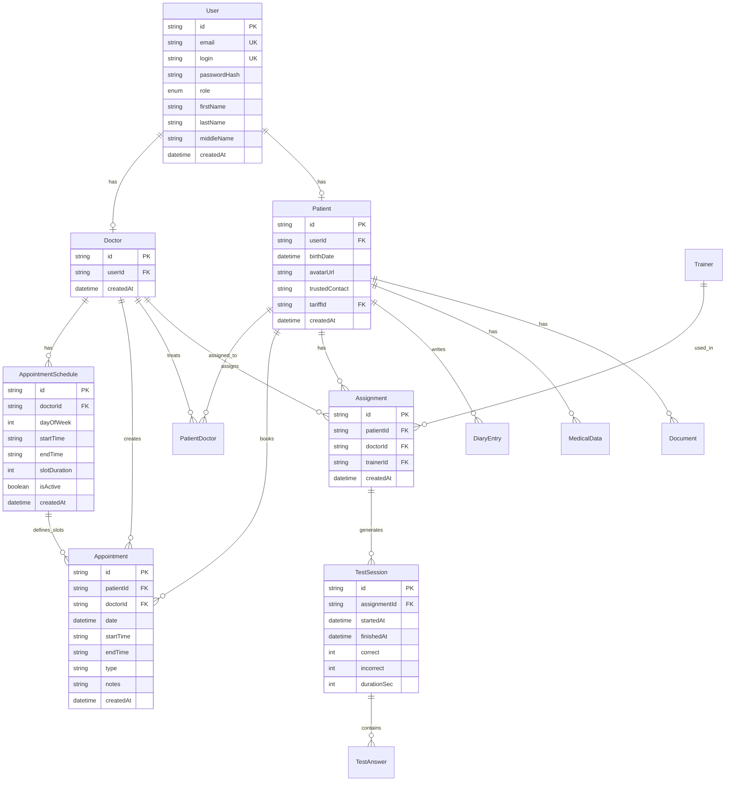
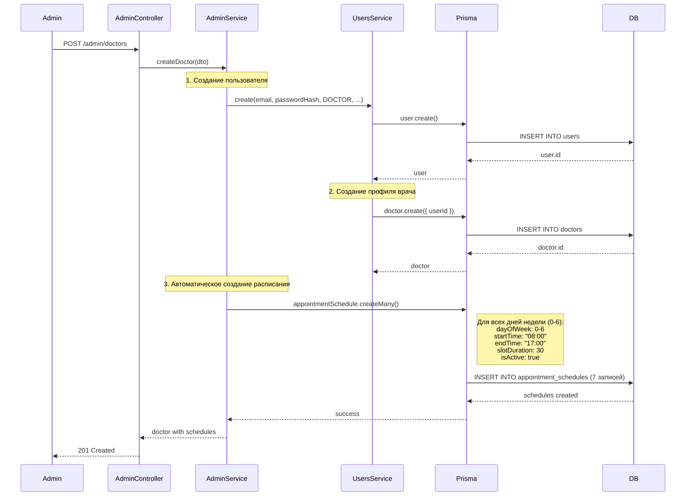
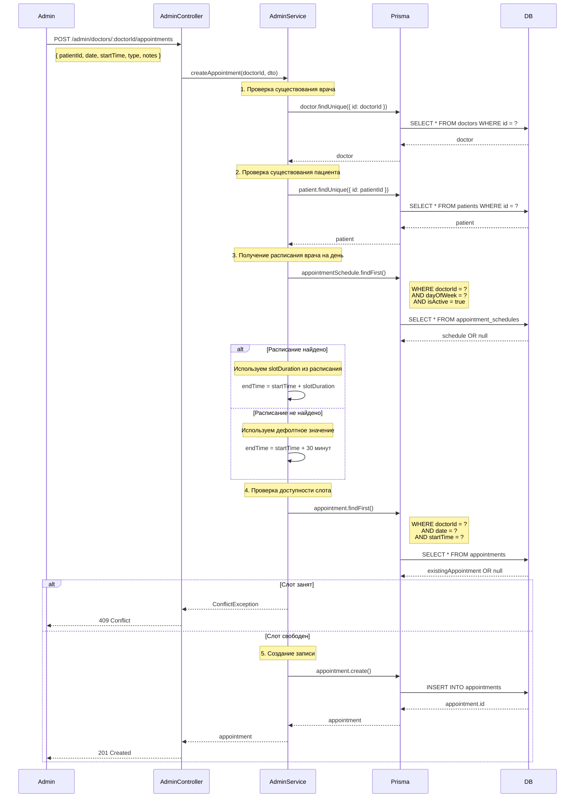
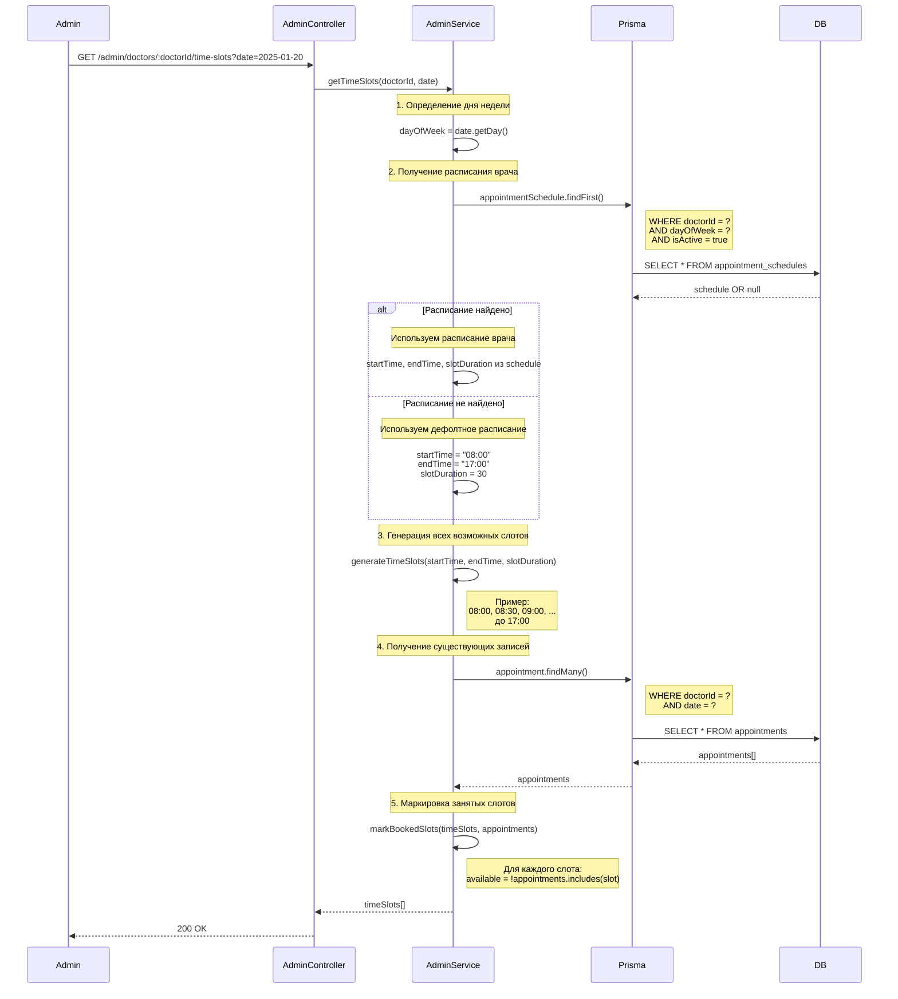
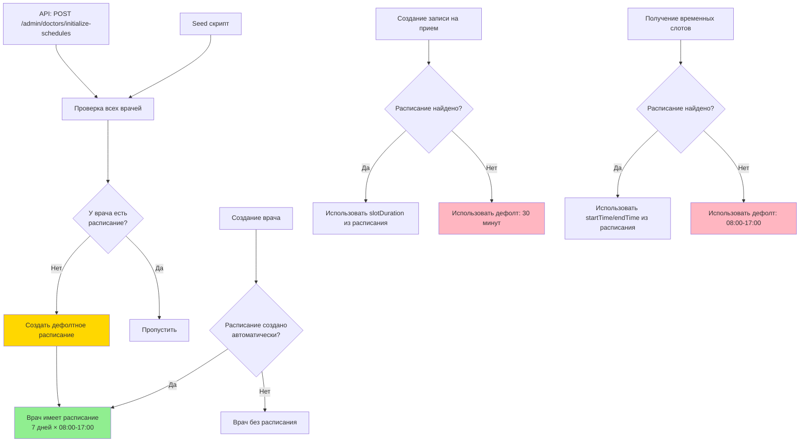

# Архитектура бэкенда - Визуальная схема

## 📊 Схема базы данных (ERD)



## 🔄 Процесс создания врача и его расписания



## 📅 Процесс создания записи на прием



## 🔍 Процесс получения доступных временных слотов



## 🛡️ Гарантии наличия расписания у всех врачей



## 📋 Ключевые моменты работы с расписаниями

### 1. **Создание врача** (`AdminService.createDoctor`)
- ✅ Автоматически создает расписание для всех 7 дней недели
- ✅ Дефолтные значения: 08:00-17:00, слоты по 30 минут
- ✅ Все записи помечаются как активные (`isActive: true`)

### 2. **Инициализация для существующих врачей** (`AdminService.initializeDefaultSchedulesForAllDoctors`)
- ✅ Проверяет всех врачей в системе
- ✅ Для врачей без расписания создает дефолтное
- ✅ Вызывается в seed скрипте автоматически
- ✅ Доступен через API: `POST /admin/doctors/initialize-schedules`

### 3. **Создание записи на прием** (`AdminService.createAppointment`)
- ✅ Проверяет существование врача и пациента
- ✅ Ищет расписание врача на конкретный день недели
- ✅ Если расписание не найдено → использует дефолт (30 минут)
- ✅ Проверяет уникальность слота (doctorId + date + startTime)
- ✅ Вычисляет endTime на основе slotDuration

### 4. **Получение временных слотов** (`AdminService.getTimeSlots`)
- ✅ Определяет день недели из даты
- ✅ Ищет расписание врача на этот день
- ✅ Если расписание не найдено → использует дефолт (08:00-17:00, 30 минут)
- ✅ Генерирует все возможные слоты
- ✅ Помечает занятые слоты на основе существующих записей

### 5. **Получение доступных дат** (`AdminService.getAvailableDates`)
- ✅ Получает все активные расписания врача
- ✅ Если расписаний нет → возвращает все будущие даты в диапазоне
- ✅ Генерирует список дат, на которые есть хотя бы один рабочий день

## 🔐 Зависимости и ограничения

### Внешние ключи (Foreign Keys)
- `Doctor.userId` → `User.id` (CASCADE DELETE)
- `Patient.userId` → `User.id` (CASCADE DELETE)
- `AppointmentSchedule.doctorId` → `Doctor.id` (CASCADE DELETE)
- `Appointment.doctorId` → `Doctor.id` (CASCADE DELETE)
- `Appointment.patientId` → `Patient.id` (CASCADE DELETE)

### Уникальные ограничения
- `Appointment`: `(doctorId, date, startTime)` - один слот может быть занят только одной записью
- `HiddenDocument`: `(patientId, documentId)` - один документ может быть скрыт только один раз

### Каскадное удаление
- При удалении `User` → автоматически удаляются связанные `Doctor`/`Patient`
- При удалении `Doctor` → автоматически удаляются `AppointmentSchedule` и `Appointment`
- При удалении `Patient` → автоматически удаляются `Appointment`, `DiaryEntry`, `MedicalData`, и т.д.

## ✅ Проверка корректности работы

### Тестовый сценарий:
1. **Создать нового врача** → Проверить, что создано 7 записей в `appointment_schedules`
2. **Создать запись на прием** → Проверить, что запись создана с корректным `endTime`
3. **Получить временные слоты** → Проверить, что занятые слоты помечены как `available: false`
4. **Вызвать initialize-schedules** → Проверить, что все врачи без расписания получили его

### SQL запросы для проверки:

```sql
-- Проверить всех врачей и их расписания
SELECT 
    d.id as doctor_id,
    u.firstName || ' ' || u.lastName as doctor_name,
    COUNT(as.id) as schedule_count
FROM doctors d
LEFT JOIN users u ON d.userId = u.id
LEFT JOIN appointment_schedules as ON as.doctorId = d.id
GROUP BY d.id, u.firstName, u.lastName;

-- Проверить записи на прием и их соответствие расписанию
SELECT 
    a.id,
    a.date,
    a.startTime,
    a.endTime,
    as.slotDuration,
    EXTRACT(EPOCH FROM (a.endTime::time - a.startTime::time))/60 as actual_duration_minutes
FROM appointments a
LEFT JOIN appointment_schedules as ON as.doctorId = a.doctorId 
    AND as.dayOfWeek = EXTRACT(DOW FROM a.date)
    AND as.isActive = true
ORDER BY a.date DESC, a.startTime;
```
