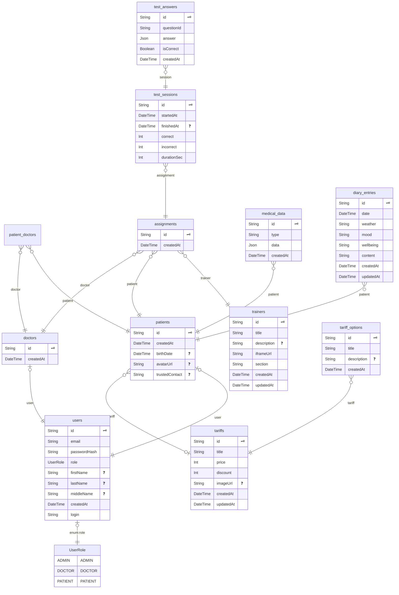

```mermaid
erDiagram

        UserRole {
            ADMIN ADMIN
DOCTOR DOCTOR
PATIENT PATIENT
        }
    
  "users" {
    String id "🗝️"
    String email 
    String passwordHash 
    UserRole role 
    String firstName "❓"
    String lastName "❓"
    String middleName "❓"
    DateTime createdAt 
    String login 
    }
  

  "patients" {
    String id "🗝️"
    DateTime createdAt 
    DateTime birthDate "❓"
    String avatarUrl "❓"
    String trustedContact "❓"
    }
  

  "doctors" {
    String id "🗝️"
    DateTime createdAt 
    }
  

  "patient_doctors" {

    }
  

  "trainers" {
    String id "🗝️"
    String title 
    String description "❓"
    String iframeUrl 
    String section 
    DateTime createdAt 
    DateTime updatedAt 
    }
  

  "assignments" {
    String id "🗝️"
    DateTime createdAt 
    }
  

  "test_sessions" {
    String id "🗝️"
    DateTime startedAt 
    DateTime finishedAt "❓"
    Int correct 
    Int incorrect 
    Int durationSec 
    }
  

  "test_answers" {
    String id "🗝️"
    String questionId 
    Json answer 
    Boolean isCorrect 
    DateTime createdAt 
    }
  

  "tariffs" {
    String id "🗝️"
    String title 
    Int price 
    Int discount 
    String imageUrl "❓"
    DateTime createdAt 
    DateTime updatedAt 
    }
  

  "tariff_options" {
    String id "🗝️"
    String title 
    String description "❓"
    DateTime createdAt 
    }
  

  "medical_data" {
    String id "🗝️"
    String type 
    Json data 
    DateTime createdAt 
    }
  

  "diary_entries" {
    String id "🗝️"
    DateTime date 
    String weather 
    String mood 
    String wellbeing 
    String content 
    DateTime createdAt 
    DateTime updatedAt 
    }
  
    "users" |o--|| "UserRole" : "enum:role"
    "patients" }o--|o tariffs : "tariff"
    "patients" |o--|| users : "user"
    "doctors" |o--|| users : "user"
    "patient_doctors" }o--|| doctors : "doctor"
    "patient_doctors" }o--|| patients : "patient"
    "assignments" }o--|| doctors : "doctor"
    "assignments" }o--|| patients : "patient"
    "assignments" }o--|| trainers : "trainer"
    "test_sessions" }o--|| assignments : "assignment"
    "test_answers" }o--|| test_sessions : "session"
    "tariff_options" }o--|| tariffs : "tariff"
    "medical_data" }o--|| patients : "patient"
    "diary_entries" }o--|| patients : "patient"
```
